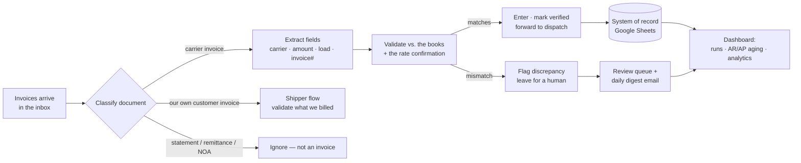
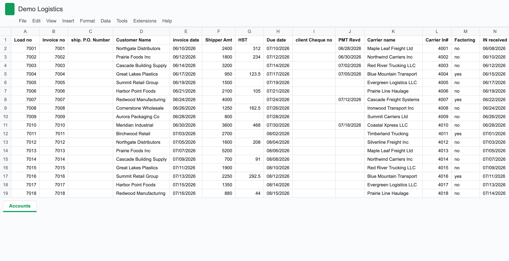
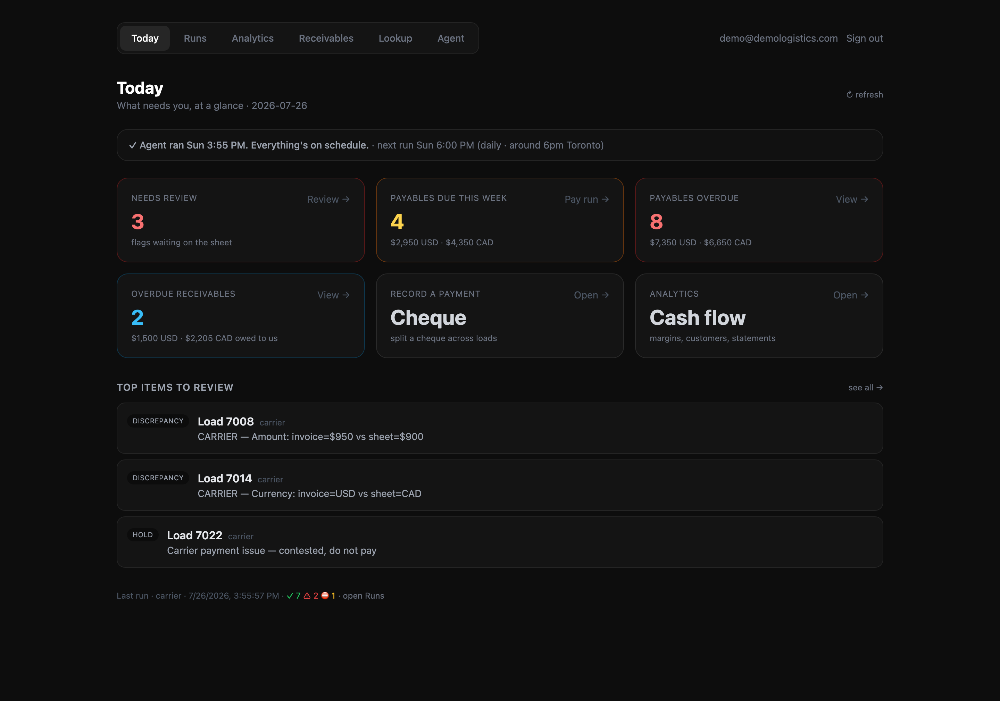
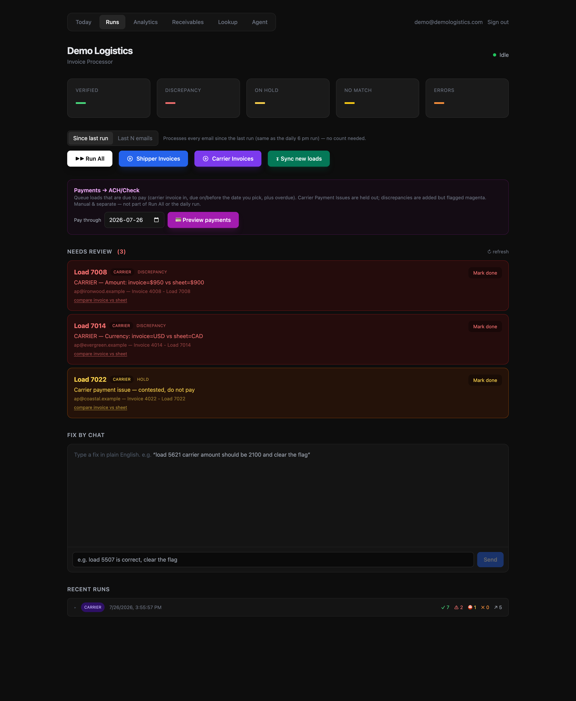
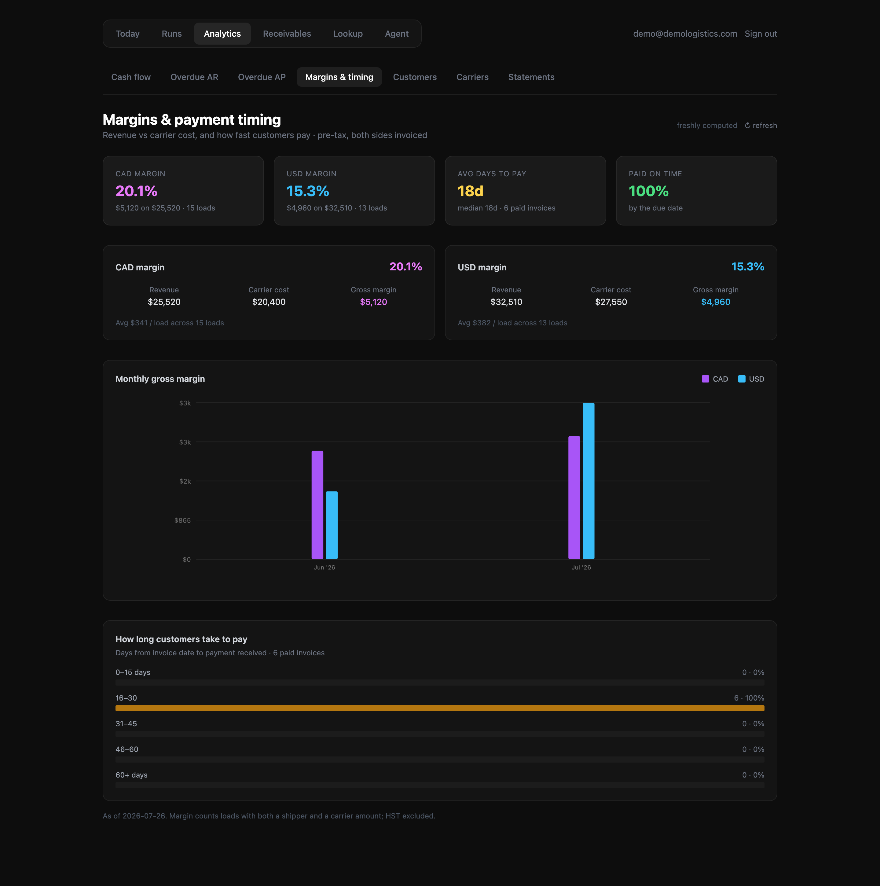
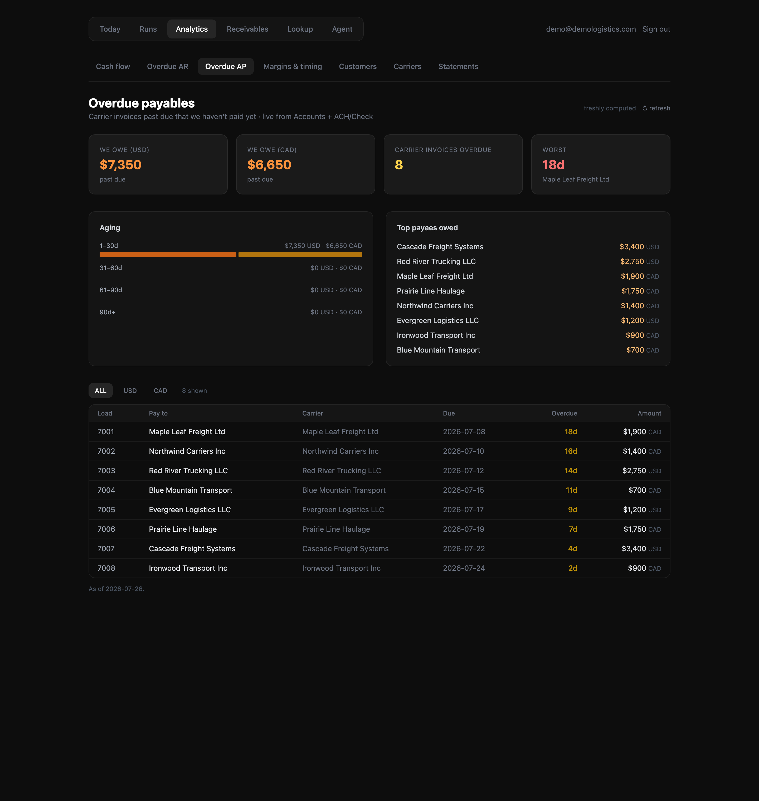
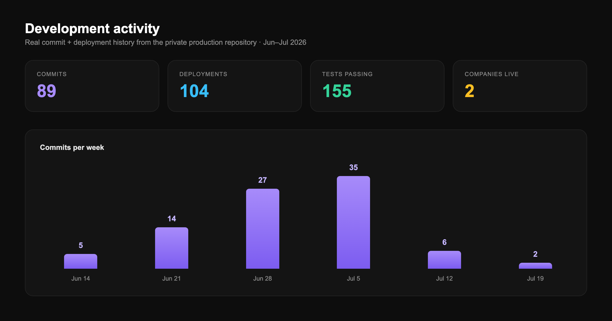

# Freight AP/AR Agent — an AI back-office for a logistics brokerage

> ### ⚠️ About this repository
> **This is a sanitized public duplicate of a private production repository.** It has been scrubbed of all secrets, credentials, and confidential business data — real company, carrier, and customer names, email addresses, financial figures, and API keys have been removed or replaced with placeholders. The code and architecture are faithful to the real system; only the sensitive data is fictional. It exists to **demonstrate the engineering** behind a live product without exposing a real business's financials or its partners' information.

An autonomous AI agent that runs the accounting back-office of a freight brokerage. It reads carrier and customer invoices straight out of the inbox, understands them the way an accountant would, reconciles them against the books, catches errors, and only asks a human when it genuinely should — running on a daily schedule against real money.

---

## Why it exists

A freight broker is a middleman: it books freight from customers who need goods shipped and hands the actual driving to trucking companies (carriers). It makes money on the spread — charge the customer more than the carrier costs. That means **every dollar in and every dollar out has to be reconciled**, or the margin is a guess. In practice that's a person opening hundreds of invoice emails, reading each PDF, and typing carrier, amount, load number, and invoice number into a spreadsheet — high-volume, repetitive, and exactly where fatigue turns into costly mistakes.

**Impact (real deployment):**
- Cut the accounting/data-entry workload by **~70%** at a brokerage doing **~$4M gross revenue**, for about **$30/month** in model API cost.
- A second brokerage (~$6M revenue) now runs a prototype with **~50%** efficiency gains.
- Beyond speed, it **catches human mistakes** — e.g. it flagged a carrier bill entered at the wrong amount because the *invoice* said one thing and a person had typed another.

---

## How it works



The agent runs as a **daily scheduled job** (plus on-demand from the dashboard). Each run has two lanes that mirror the two sides of every load:

- **Carrier lane** — third-party trucking invoices (money *out*). Read the invoice, match it to the load and the agreed rate, and if it's clean, enter it and forward it to dispatch to pay.
- **Shipper lane** — the brokerage's *own* invoices to its customers (money *in*). Confirm what was billed matches the books.

Both lanes share the same spine: **classify → extract → validate → enter or flag.**

1. **Classify, then extract.** A vision LLM first decides *what a document is* before pulling any numbers. Real inboxes are full of look-alikes — account statements, payment remittances, Notices of Assignment, bills of lading, proof-of-delivery scans, packing slips. Extracting from the wrong one silently corrupts the books, so classification is the most important step, not an afterthought.
2. **Read the messy real world.** Many invoices are faxed scans, phone photos, or flattened image PDFs with no text layer. Those are rendered and read page-by-page with vision OCR — stopping as soon as the needed fields are found (cost control) and retrying at higher resolution when a scan is illegible.
3. **Get the hard fields right.** The agent is hardened against the traps that quietly break naive extraction: **invoice-number vs. load-number** confusion, alphanumeric invoice IDs (`I094927`, `HT147`), malformed totals, multi-stop loads billed under one number, and multi-page factoring bundles where the real invoice is one page among six.
4. **Understand factoring.** Carriers often sell their invoices to a factoring company, so the money has to go to a *different* party than the one that hauled the load. The agent captures the correct remit-to company **and its banking address**, and never mistakes a standalone assignment letter for an invoice.
5. **Validate against the books.** Extracted values are checked against the system of record and the rate confirmation. A match is entered and (carrier side) forwarded to dispatch; a mismatch is flagged, highlighted, and left for a human — the agent is fast where it's confident and deferential where it isn't.

---

## The data model

The **system of record is a Google Sheet** — deliberately. The team already lived in a spreadsheet; rather than force a migration to a new tool, the agent *meets them where they are* and writes into the sheet they already trust. Every row is one load, with a **shipper side** (what a customer owes us) and a **carrier side** (what we owe a carrier), plus the margin between them:



- **Shipper side:** `Invoice no`, `Customer Name`, `Shipper Amt`, `HST`, `Due date`, `PMT Revd` (payment received).
- **Carrier side:** `Carrier name`, `Carrier In#`, `Carrier Amount`, `IN received`, `Payment due date`, `Factoring`.
- **Derived:** `margin`, aging, and HST totals are **spreadsheet formulas** — the agent only writes the *facts it extracted* and leaves the formulas intact, so the sheet stays live and human-editable.

This is also what makes the system trustworthy: a human can open the sheet at any time, see exactly what the agent did, and correct it — and the agent's self-audit reads this same sheet back to check itself (below).

---

## Demo

> All screenshots run on a **synthetic dataset** — every carrier, customer, and dollar figure is fictional — so the real business's data is never shown.

| The "what needs you" home | The processing console + self-reconciling review queue |
| :---: | :---: |
|  |  |
| **Margins & payment-timing analytics** | **AR/AP aging** (overdue payables shown) |
|  |  |

---

## Under the hood

### Document understanding
A two-stage **classify-then-extract** pipeline over a vision LLM. Classification separates true carrier invoices from the six-or-more look-alike document types that share an inbox. Extraction is schema-constrained and label-driven: it reads the *label* next to a number (`Invoice #` vs `Load #` vs `PO #` vs `BOL`) rather than guessing from format, which is what defeats the invoice-vs-load-number trap. Prompt changes are **adversarially regression-tested** against a corpus of real documents before shipping — a fix has to repair the target case *and* leave every previously-correct case untouched.

### Validation & self-auditing
Verification isn't just "did we read a number" — it's "does the number agree with the agreed rate and the books." When a separate rate confirmation is present, it's treated as the authoritative source and cross-checked against the invoice. Separately, a **read-only consistency audit** re-reads the live sheet and compares every row against the agent's own cached reading of the source document — catching drift, human edits, and the rare corruption. That same harness was used to **quantify AI vs. human accuracy** on a shared, hand-verified ground truth.

### Reliability & idempotency
Built to run unattended:
- **Per-lane email watermarks** so each run picks up exactly where it left off and never double-processes.
- An **extraction cache keyed by message + attachment**, so any given PDF is sent to the model **once** — re-runs are free and deterministic.
- A **run-in-progress lock** so a manual run and the scheduled run can't collide.
- A **dual state backend** — Postgres in production, local files in dev — behind one interface.

### Trust & human-in-the-loop
The hard rule is **never move money autonomously.** Discrepancies are flagged and highlighted, contested payments are held out of any pay run, and ambiguous documents are left untouched for a person. Everything that needs a human lands in a **review queue that reconciles itself** — items auto-clear once the underlying row is fixed on the sheet — and in a **daily digest email**. Operational behavior (extraction prompts, sender block-lists) lives in the database and is **editable from the dashboard**, taking effect everywhere within seconds — no redeploy to change how the AI reads.

---

## Tech stack

| Layer | Tech |
| --- | --- |
| AI | Claude (vision + structured extraction) |
| Backend | Python, FastAPI |
| Frontend | Next.js, TypeScript, Tailwind |
| Data / state | Supabase Postgres, Google Sheets (system of record) |
| Integrations | Zoho Mail, QuickBooks |
| Infra | Render (API + daily cron), Vercel (dashboard), Google SSO auth |

---

## What's next

- **QuickBooks integration.** Push AR invoices and AP carrier bills into QuickBooks so the books reconcile against real accounting — including multicurrency (CAD/USD) with proper FX handling. The core sync is built; wiring it into the daily flow is the next step, so "entered in the sheet" and "on the P&L" stay in lockstep.
- **Local bank reconciliation.** Ingest the bank transaction feed and auto-match deposits and withdrawals to the invoices and payments already tracked — closing the loop from *invoiced* to *actually cleared*, and automatically surfacing short-pays, overpays, and remittances that were never recorded (a real, money-losing gap today).
- **A full AI-native TMS, as a SaaS.** Turn the single-tenant tool into a config-driven, multi-tenant platform any small brokerage can onboard by pointing it at their mailbox and their books — a Transportation Management System where the accounting runs itself. The two-company deployment already proves the model generalizes; the work is making tenancy, onboarding, and billing first-class.

---

## Provenance

A real, evolving product — not a weekend prototype. The chart below is the actual commit + deployment history from the private production repository:



- **89 commits and 104 deployments** across roughly six weeks of intensive, near-daily iteration (Jun–Jul 2026).
- Runs **in production today**: a scheduled daily cron processes the inbox and emails a digest; a small team relies on the dashboard.
- **155 passing tests** cover the extraction, classification, and matching logic.
- Deployed for **two separate brokerages** from the same codebase.

## Repository layout

```
run_carrier_batch.py / run_batch.py   # the carrier and shipper invoice pipelines
run_scheduled.py                      # daily cron: sync → process → digest email
prompts.py                            # DB-backed, live-editable AI prompts
analytics.py / reconcile.py           # AR/AP aging, margins, self-reconciliation
audit.py                              # read-only sheet-vs-AI consistency audit
sync_*_to_quickbooks.py               # QuickBooks AR/AP sync (in progress)
api/                                  # FastAPI service
web/                                  # Next.js dashboard
tests/                                # pipeline logic tests
```

## Running it

Requires your own credentials (none are included here). Copy `.env.example` → `.env`, fill in the placeholders (model API key, mail + sheets access, database URL), and share your Google Sheet with the service account. This repo is a **showcase**, not a turnkey deployment — the real system points at a live business's data.

---

*Built by a student to give time back to the family business that raised him.*
