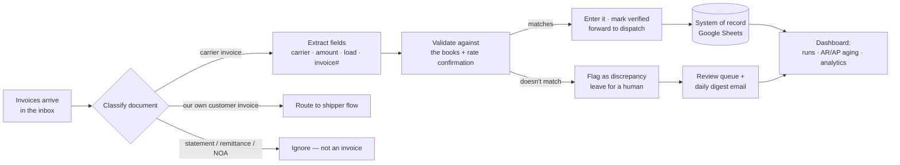

# Freight AP/AR Agent — an AI back-office for a logistics brokerage

> ### ⚠️ About this repository
> **This is a sanitized public duplicate of a private production repository.** It has been scrubbed of all secrets, credentials, and confidential business data — real company, carrier, and customer names, email addresses, financial figures, and API keys have been removed or replaced with placeholders. The code and architecture are faithful to the real system; only the sensitive data is fictional. It exists to **demonstrate the engineering** behind a live product without exposing a real business's financials or its partners' information.

An autonomous AI agent that runs the accounting back-office of a freight brokerage. It reads carrier and customer invoices straight out of the inbox, understands them the way an accountant would, reconciles them against the books, catches errors, and only asks a human when it genuinely should — running on a daily schedule against real money.

---

## Why it exists

A freight broker sits between companies that need goods shipped and the trucking companies that haul them. All day, invoices pour into the inbox that someone has to read, sanity-check, and type into a spreadsheet so every incoming and outgoing dollar is accounted for. At volume, that work is overwhelming and error-prone — and it's exactly the kind of pattern a machine can learn.

**Impact (real deployment):**
- Reduced the accounting/data-entry workload by **~70%** at a brokerage doing **~$4M gross revenue**, for about **$30/month** in model API cost.
- A second brokerage (~$6M revenue) is now running a prototype with **~50%** efficiency gains.
- Beyond speed, it **catches human mistakes** — e.g. surfacing a carrier bill recorded at the wrong amount that a person had mistyped.

---

## How it works



1. **Classify, then extract.** A vision LLM first decides *what a document is* — a third-party carrier invoice, the brokerage's own customer invoice, or a statement/remittance/Notice-of-Assignment — and only then extracts data, so it never files the wrong thing.
2. **Read the messy real world.** Faxed scans, phone photos, and image-only PDFs are read page-by-page with vision OCR (with a higher-resolution retry for illegible scans). It beats the classic traps: invoice-number vs. load-number, alphanumeric invoice IDs, malformed totals, and multi-stop loads.
3. **Understand factoring.** When a carrier sells its invoice to a factoring company, the agent captures the correct remit-to company and banking details so payments route to the right place — and never mistakes a standalone assignment notice for an invoice.
4. **Validate against the books.** Extracted values are checked against the system of record and the rate confirmation. Matches are entered and forwarded; mismatches are flagged and left for a person.
5. **Human-in-the-loop by design.** It never moves money on its own. Ambiguous items are left untouched, contested payments are held, and everything surfaces in a clean daily digest and a review queue that reconciles itself as humans resolve items.

---

## Demo

> All screenshots run on a **synthetic dataset** — every carrier, customer, and dollar figure below is fictional — so the real business's data is never shown.

| The "what needs you" home | The processing console + self-reconciling review queue |
| :---: | :---: |
|  |  |
| **Margins & payment-timing analytics** | **AR/AP aging** (overdue payables shown) |
|  |  |

---

## Technical highlights

- **Document AI pipeline** — classify-then-extract with a vision LLM; page-by-page OCR for scanned/photographed PDFs; adversarially evaluated prompt changes (regression-tested against real documents before shipping).
- **Live-editable behavior** — prompts and block-lists live in the database and take effect across the whole system within seconds, with no redeploy.
- **Durability & idempotency** — per-lane email watermarks, an extraction cache keyed by message+attachment (so a PDF is never sent to the API twice), run-in-progress locks, and a dual backend (Postgres, or local files in dev).
- **Self-auditing** — a read-only consistency pass compares the live books against the agent's own cached readings to detect drift or corruption, and was used to *quantify AI vs. human accuracy* on the same ground truth.
- **Trust & safety** — sender block-lists, factoring bank-routing safeguards, and a strict "never auto-move money" rule.

## Tech stack

| Layer | Tech |
| --- | --- |
| AI | Claude (vision + structured extraction) |
| Backend | Python, FastAPI |
| Frontend | Next.js, TypeScript, Tailwind |
| Data / state | Supabase Postgres, Google Sheets (system of record) |
| Integrations | Zoho Mail, QuickBooks |
| Infra | Render (API + daily cron), Vercel (dashboard), Google SSO auth |

## Provenance

This is a real, evolving product — not a weekend prototype:

- Developed over **~3 months** of near-daily iteration (Apr–Jul 2026), across **~90 commits** and **100+ deployments**.
- Runs **in production today**: a scheduled daily cron processes the inbox and emails a digest; a small team relies on the dashboard.
- **155 passing tests** cover the extraction, classification, and matching logic.
- Built solo, using AI (Claude) as a pair-programmer — I owned the architecture, the domain modeling, the prompt engineering, and the verification against hundreds of hand-checked real invoices.

## Repository layout

```
run_carrier_batch.py / run_batch.py   # the two invoice-processing pipelines
run_scheduled.py                      # daily cron: sync → process → digest email
prompts.py                            # DB-backed, live-editable AI prompts
analytics.py / reconcile.py           # AR/AP aging, margins, self-reconciliation
audit.py                              # read-only sheet-vs-AI consistency audit
api/                                  # FastAPI service
web/                                  # Next.js dashboard
tests/                                # pipeline logic tests
```

## Running it

Requires your own credentials (none are included here). Copy `.env.example` → `.env`, fill in the placeholders (model API key, mail + sheets access, database URL), and share your Google Sheet with the service account. This repo is a **showcase**, not a turnkey deployment — the real system points at a live business's data.

---

*Built by a student to give time back to the family business that raised him.*
